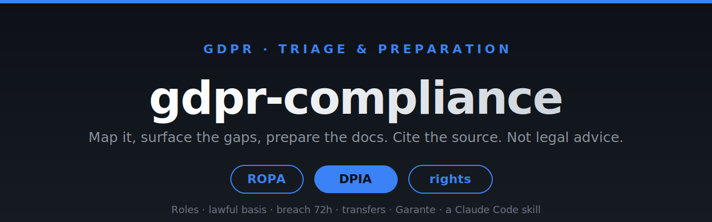

<a name="top"></a>

<div align="center">



### Map the processing, surface the obligations and gaps, prepare the documents (ROPA, DPIA). It cites the article and the official source. It is not legal advice.

[](https://github.com/giorgiozamboni/gdpr-compliance/stargazers)
[](https://github.com/giorgiozamboni/gdpr-compliance/network/members)
&nbsp;
[](LICENSE)
[](HANDOFF.md)
[](https://claude.com/claude-code)
[](#-italian-layer-garante)

**[Workflow](#-how-it-works)** · **[What it covers](#-what-it-covers)** · **[Report Bug](https://github.com/giorgiozamboni/gdpr-compliance/issues)** · **[PlayMind Studio](https://playmindstudio.it/)**

</div>

---

## 🔐 What is gdpr-compliance

A Claude Code skill that helps an SME (and the consultant serving it) get **organised and ready** on data
protection: map the situation, surface the obligations and gaps, prepare the documents. Two rules govern
everything, because this is law:

1. **It is not legal advice.** Triage, preparation, organisation. It does not decide whether someone is
   compliant and does not replace a lawyer or a DPO. Outputs are framed as "here is what applies and what
   to prepare / check", never as a verdict.
2. **No false certainty.** It cites the official source for every substantive point, flags what is settled
   versus in flux, and never states a deadline, threshold, or legal definition from memory.

> ⚠️ **Status: v0.9.0.** The reference and template content was authored on 2026-07-08 with source
> verification of the volatile items, but it is legal material and should be reviewed (ideally by a
> lawyer/DPO) and re-checked for currency before use with clients. See [HANDOFF.md](HANDOFF.md).

<p align="right">(<a href="#top">back to top</a>)</p>

## 🧭 How it works

1. **Intake** (`assets/intake-questionnaire.md`): who the organisation is, what personal data it processes,
   why, from whom, where it flows, who else touches it.
2. **Map the role**: controller, processor, or joint controller. Obligations follow the role.
3. **Classify the processing**: ordinary vs special-category (Art. 9), automated decisions/profiling
   (Art. 22, the AI Act seam), large-scale monitoring, international transfers.
4. **Enumerate obligations** for that role and processing type (read the relevant reference).
5. **Check current state**: web-search the official source (EDPB, Garante, EUR-Lex) for anything
   time-sensitive before asserting it.
6. **Flag confidence**: ✓ Settled · ⚠ Verify now · ⛔ Get counsel.
7. **Produce the output**: a gap analysis, a checklist, or a prepared document (ROPA, DPIA), every item
   cited and every uncertain item marked for the DPO/lawyer.

<p align="right">(<a href="#top">back to top</a>)</p>

## 🗂️ What it covers

| Topic | Reference |
|---|---|
| Controller/processor/joint roles, the 6 lawful bases, special-category data | `references/roles-and-lawful-basis.md` |
| When a DPIA is required, how to run it, prior consultation | `references/dpia.md` |
| Data-subject rights (access, erasure, portability, objection) and handling requests | `references/data-subject-rights.md` |
| Personal-data breach: what counts, the 72h notification, documentation | `references/breach-notification.md` |
| Processors, DPAs (Art. 28), sub-processors, international transfers (SCCs/adequacy) | `references/processors-and-transfers.md` |
| Records of processing (Art. 30 ROPA) and accountability | `references/records-and-accountability.md` |
| Italy: Garante, Codice Privacy, cookie/marketing, workplace monitoring | `references/italy-garante.md` |

Templates in `assets/`: `intake-questionnaire.md`, `ropa-template.md`, `dpia-template.md`.

<p align="right">(<a href="#top">back to top</a>)</p>

## 🔗 The AI Act seam

Where data protection meets the AI Act, this skill hands off explicitly to
[`ai-act-compliance`](https://github.com/giorgiozamboni/ai-act-compliance): **DPIA ↔ FRIA**, **automated
decision-making (Art. 22) ↔ high-risk AI**, and personal data in AI training/use. It does not try to cover
the AI Act itself.

<p align="right">(<a href="#top">back to top</a>)</p>

## 🇮🇹 Italian layer (Garante)

It flags Italy-specific points: the **Garante** as supervisory authority, the **Codice Privacy**
(D.lgs. 196/2003 as amended), the digital-consent age, workplace-monitoring limits (Statuto dei
Lavoratori), and cookie/marketing rules, each routed to the official source for currency.

<p align="right">(<a href="#top">back to top</a>)</p>

## 📦 Install

**Option A — drop-in folder (Claude Code):**
```bash
git clone https://github.com/giorgiozamboni/gdpr-compliance.git
cp -r gdpr-compliance ~/.claude/skills/gdpr-compliance
```

**Option B — packaged skill:**
Download `gdpr-compliance.skill` from [Releases](https://github.com/giorgiozamboni/gdpr-compliance/releases)
and install it via the `/plugin` interface in Claude Code.

It needs web access (to verify sources) and has no `allowed-tools` restriction for that reason.

<p align="right">(<a href="#top">back to top</a>)</p>

## 💬 Usage

- "are we GDPR-compliant?" (it will reframe this as: here is what applies and what to prepare)
- "we had a data breach, what now?"
- "do we need a DPIA for this?"
- "trattiamo dati dei clienti, siamo a posto?"
- "un cliente ci ha chiesto l'accesso ai suoi dati"

You get a cited, flagged answer and prepared documents, never a from-memory verdict.

<p align="right">(<a href="#top">back to top</a>)</p>

## ⚠️ Disclaimer

This skill is a preparation and organisation aid. It is **not legal advice**, does not certify compliance,
and does not replace a lawyer or a Data Protection Officer. For high-stakes or genuinely uncertain points,
consult qualified counsel and the current official sources.

<p align="right">(<a href="#top">back to top</a>)</p>

## 🤝 Contributing

The most valuable contribution is keeping it **accurate and correctly sourced**. See
[CONTRIBUTING.md](CONTRIBUTING.md). Every change to a deadline, threshold, or definition must cite the
official source and the date it was verified.

<p align="right">(<a href="#top">back to top</a>)</p>

## 👤 Author

Built by **Giorgio Zamboni** at **[PlayMind Studio](https://playmindstudio.it/)**.

- 🌐 [playmindstudio.it](https://playmindstudio.it/) · 💼 [LinkedIn](https://www.linkedin.com/in/giorgio-zamboni-engineer/) · 🐙 [@giorgiozamboni](https://github.com/giorgiozamboni)

## 📄 License

MIT. See [LICENSE](LICENSE). The MIT licence covers the software/text; it is not a warranty of legal
accuracy.

---

<div align="center">
<sub>Built by <a href="https://playmindstudio.it/">Giorgio Zamboni · PlayMind Studio</a> with the Claude Code skill-creator. Cite the source. Not legal advice.</sub>
</div>
